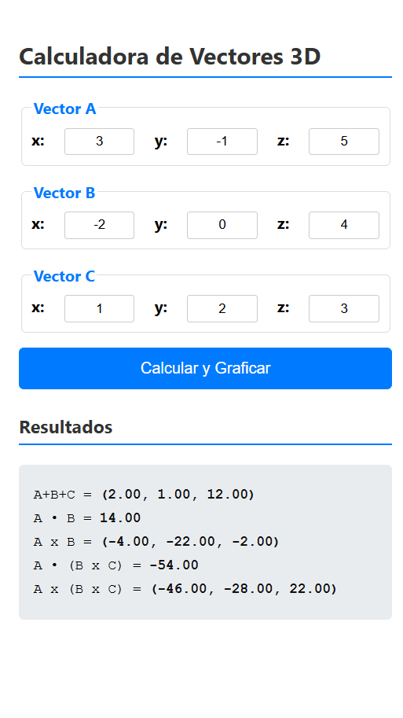

#  Calculadora de Vectores 3D

> Una aplicación web interactiva para calcular y visualizar operaciones con vectores en un entorno 3D.

---

## Características

Calcula y visualiza las siguientes operaciones con vectores:

* Suma de vectores (A + B + C)
* Producto Punto (A ⋅ B)
* Producto Cruz (A x B)
* Producto Mixto (A ⋅ (B x C))
* Triple Producto Vectorial (A x (B x C))

---

## Tecnologías Utilizadas

* **JavaScript**
* **Three.js**
* **D3.js**

---

## Uso

* No se requiere instalación. Simplemente abre el link de la aplicación en cualquier navegador web moderno.
* [Calculadora de Vectores 3D] *(https://chicharo0010.github.io/vectoress/)*
* Introduce los datos de 3 vectores
* Da click en calcular y graficar

---

## Integrantes
* Pérez German Alan David
* Sanchez Trujillo Diego
* Hernández Hernández Cesar Eduardo

---
* *Calculo de 2 vectores*

* *Calculo de 3 vectores*

* *Calculo de 3 vectores*


---

## Licencia

Este proyecto se distribuye bajo la **Licencia MIT**.


```


